# Laboratório Completo de DevOps CI/CD na AWS
## Terraform + GitHub Actions

🎯 O que será feito no Laboratório:
- Terraform: Criar e gerenciar infraestrutura como código
- GitHub Actions: Automatizar deploys e criar pipelines CI/CD
- AWS: Trabalhar com serviços em nuvem (S3, Lambda, EC2)
- DevOps: Integração e entrega contínua
- Git: Versionamento de código e colaboração

🏗️ Arquitetura do Projeto:

### 🔧 Passo 1: Preparar o Ambiente
1️⃣ Verificar Instalações

Após instalar as ferramentas, verifique se tudo está funcionando:

git --version

terraform --version

aws --version

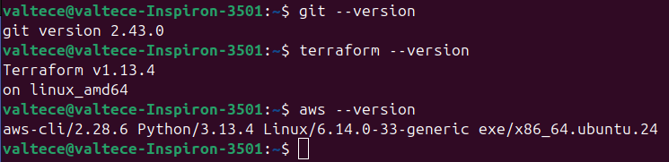 

✅ Se todos os comandos retornarem versões, você está pronto para continuar!

### 🔑 Passo 2: Configurar Credenciais AWS
⚠️ Segurança em primeiro lugar! Nunca compartilhe suas credenciais AWS. Em produção, use roles IAM e políticas mais restritivas.

1️⃣ Criar Usuário IAM na AWS

1. Acesse o Console AWS
2. Vá para IAM → Users → Create User
3. Nome do usuário: terraform-user
4. Marque "Programmatic access"
5. Anexe a política: AdministratorAccess (apenas para laboratório!)
6. Anote o Access Key ID e Secret Access Key

2️⃣ Configurar AWS CLI

aws configure

aws sts get-caller-identity

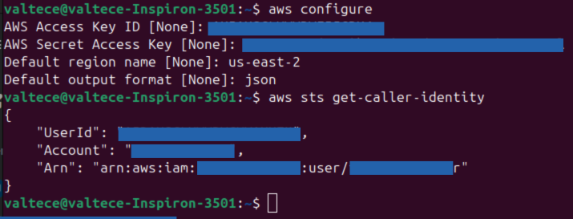

✅ Se retornar informações sobre sua conta AWS, está tudo configurado!

### 📥 Passo 3: Clonar o Repositório

1️⃣ Fazer Fork do Repositório

1. Acesse o repositório
2. Clique em "Fork" no canto superior direito
3. Escolha sua conta pessoal
4. Aguarde a criação do fork

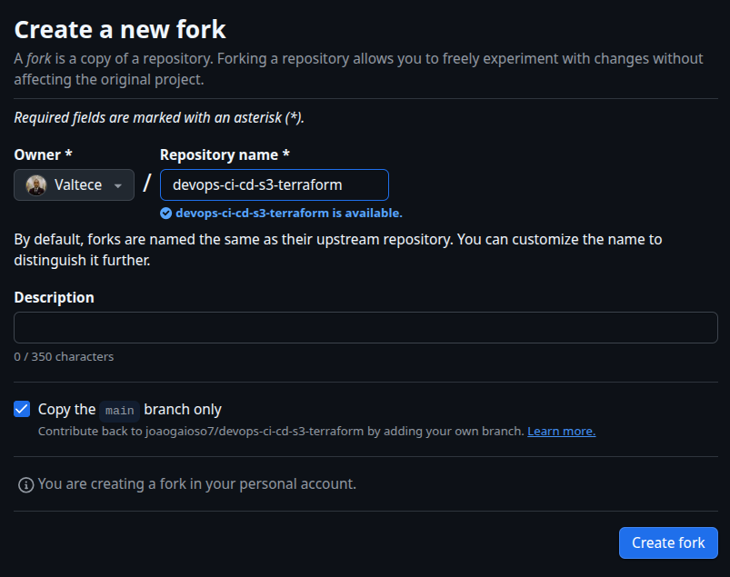

2️⃣ Clonar para sua Máquina

Clonar o repositório: git clone https://github.com/SEU_USUARIO/Lab-Terraform-Actions.git 

OBS: (substitua SEU_USUARIO) e pós o seu usuário é o nome o qual você deu para o repo do fork 

Entrar no diretório: cd Lab-Terraform-Actions/devops-ci-cd-s3-terraform

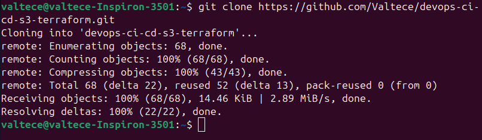

### 📄 Passo 4: Entender os Arquivos Terraform

1️⃣ main.tf - Configuração Principal 
Define providers, versões e configurações globais.

2️⃣ s3.tf - Bucket de Armazenamento 
Cria um bucket S3 seguro e privado.

3️⃣ lambda.tf - Função Serverless 
Cria uma função Lambda com role IAM.

4️⃣ ec2.tf - Máquina Virtual 
Cria uma instância EC2 com security group.

### ✏️ Passo 5: Personalizar o Projeto
⚠️ Importante: Nomes de bucket S3 devem ser únicos globalmente! Sempre personalize o nome do bucket.

1️⃣ Alterar Nome do Bucket S3 
Edite o arquivo s3.tf e altere o nome do bucket para algo único.

2️⃣ Altere o arquivo main.tf 
Poderá alterar o arquivo main.tf e colocar seu próprio nome e "owner".

3️⃣ Criar bucket no S3 
Crie um bucket no S3, que vai ser responsável por armazenar o estado de arquivo do Terraform. Refenciei o bucket no arquivo backend.tf, em "bucket =".

### 🚀 Passo 6: Executar Terraform Localmente

💡 Fluxo do Terraform: Init → Validate → Format → Plan → Apply

1️⃣ Comandos Terraform

**Inicializar** 
terraform init
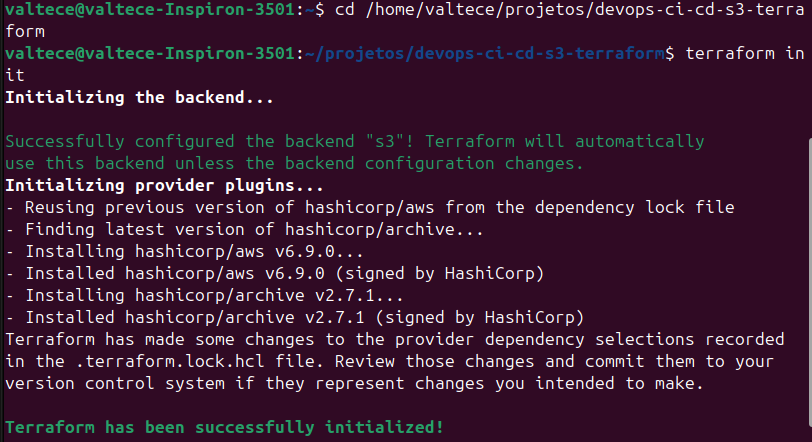

**Validar** 
terraform validate
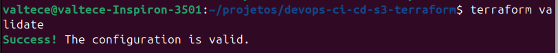

**Formatar** 
terraform fmt

**Planejar** 
terraform plan
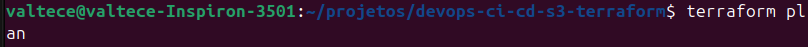

**Aplicar** 
terraform apply
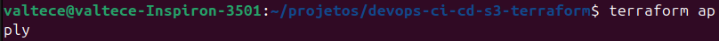

✅ Parabéns! Você criou sua primeira infraestrutura com Terraform! 🎉

### 🔐 Passo 7: Configurar GitHub Actions

1️⃣ Configurar Secrets no GitHub

Adicione suas credenciais AWS como secrets no GitHub:
- AWS_ACCESS_KEY_ID
- AWS_SECRET_ACCESS_KEY

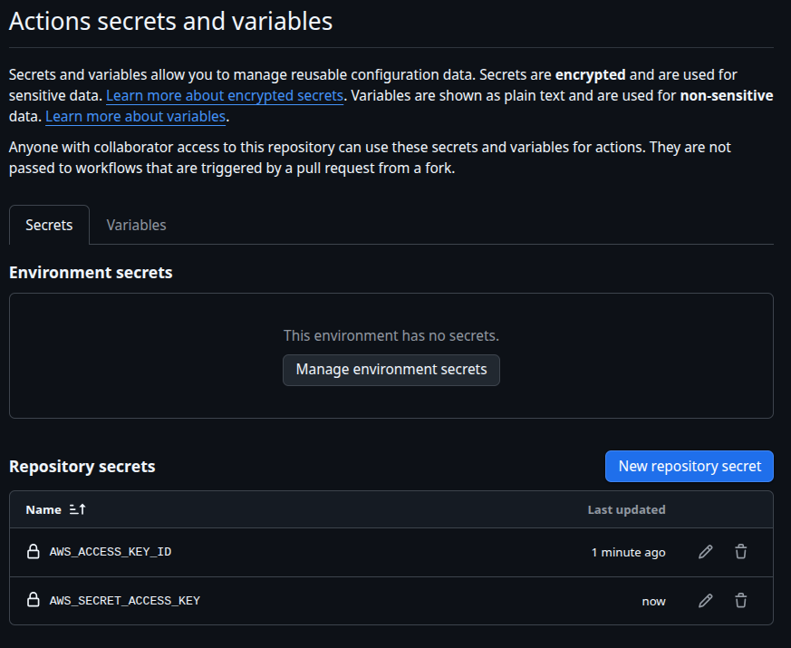

⚠️ Segurança: Nunca commite credenciais AWS no código! Sempre use GitHub Secrets.

### 🧪 Passo 8: Testar CI/CD

1️⃣ Fazer uma Mudança

Modifique alguma parte do código e faça commit: 

git add . 

git commit -m "Atualizar Código" 

git push origin main

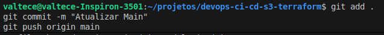

2️⃣ Acompanhar o Workflow
Vá para GitHub → Actions e acompanhe o deploy automático.

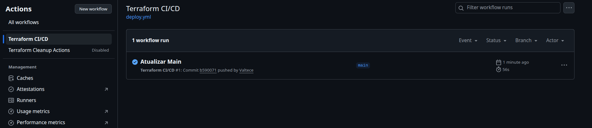

### 🧹 Passo 9: Limpeza e Cleanup
⚠️ Muito importante! Sempre execute a limpeza ao final para evitar custos desnecessários.

1️⃣ Executar Cleanup

Use o workflow de cleanup no GitHub Actions ou execute localmente:

terraform destroy

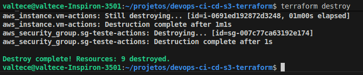

